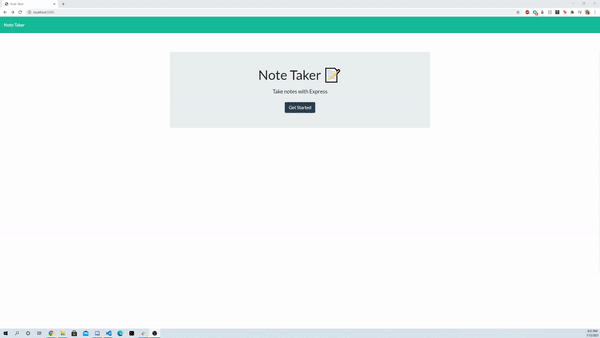

# Note Taker

## Demonstration 



## Introduction

Have the user be able to create notes for themselves, allowing the user to save their notes and delete the notes the user makes. 

## How to Install

If you want your own personal note taker please follow these steps.

Step 1: 

Run ```npm install```

Step 2:

Run ```node server.js```

Step 3: 

Open ```http://localhost:5000```


If you want to access to the deployed site, please visit:

https://notetakerapp5.herokuapp.com/

## How it works

When the user boots up the website they will be greeted with the main page that will ask the user to get started.

Once the user clicks the "Get Started" button on the main page the user will be able to create their own note page.

The top right corner will contain a "Pen" button at the right which will direct the user to start writing.

Once the user starts writing the title and description a "Save" button will show on the right allowing the user to save. Once the user "Saves", the note that the user has created will be stored on the left side. The user will be able to click on the note, however the user cannot edit this. If the user wants to go write another note the "Pen" button is accessible to all users.

The user can delete the note by hitting the red "Trash Bin" button which is located to the right of the note created. 

**Note:** The note will be deleted permanently.

Enjoy!

## Built With 
* JavaScript
* NodeJS
* Node Packages:
  * Express

## Authors 

Ryan Reyes
* [GitHub](https://github.com/ryanstorm013)
* [LinkedIn](https://www.linkedin.com/in/ryan-r-96177a157/)
